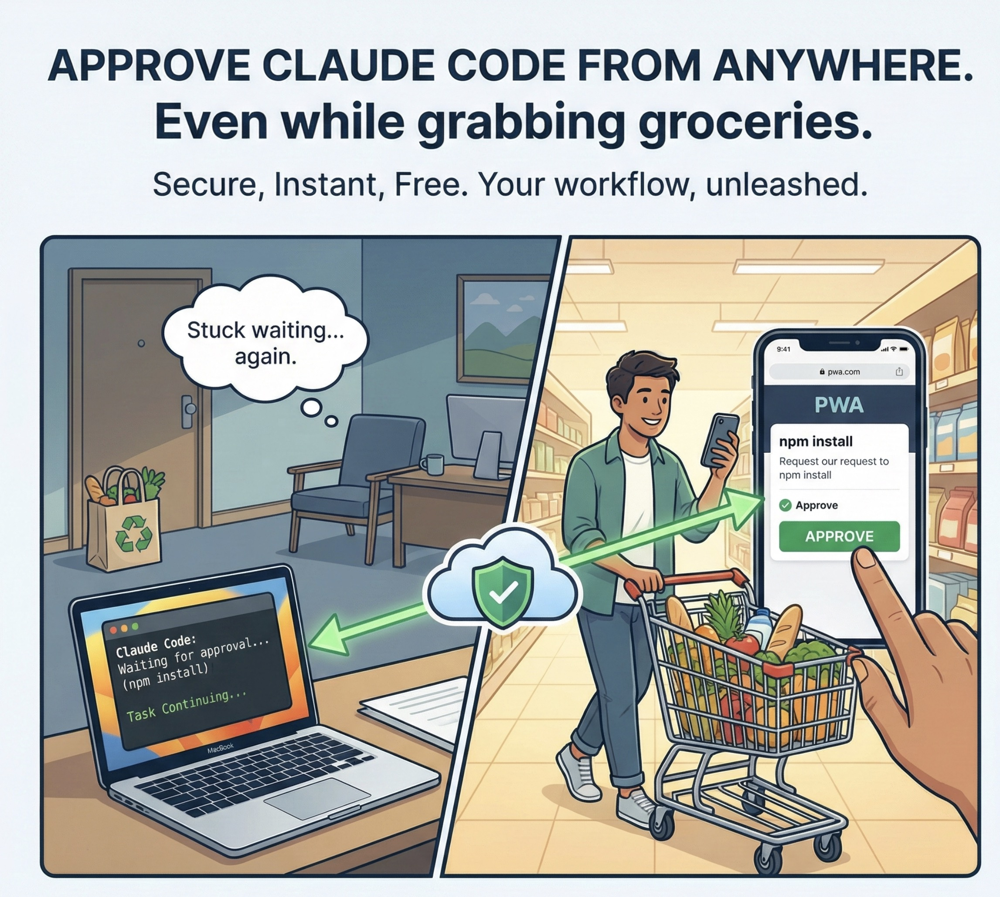

# Claude Code Notifier - Testing Approval System
<!-- Test comment for hook approval testing -->
<!-- Additional test comment added during continuous testing -->

**Approve Claude Code permission requests from your iPhone via push notifications.**



When Claude Code wants to run a command, write a file, or perform other actions, you get a push notification on your phone. Tap to review, approve or deny - all without leaving your couch.


## How It Works

```
┌─────────────────┐     ┌──────────────────┐     ┌─────────────────┐
│  Claude Code    │────▶│ Cloudflare Worker│────▶│   iPhone PWA    │
│  (with hook)    │◀────│   (API + DO)     │◀────│  (Web Push)     │
└─────────────────┘     └──────────────────┘     └─────────────────┘
```

1. Claude Code hook intercepts permission requests
2. Sends request to your Cloudflare Worker
3. Worker pushes notification to your iPhone
4. You approve/deny in the PWA
5. Claude Code continues or stops

## Features

- 🔔 **Push notifications** to iPhone (iOS 16.4+)
- 🔐 **Secure** - HMAC-SHA256 signed requests, nonce replay protection
- ⚡ **Fast** - Edge-deployed on Cloudflare Workers
- 🆓 **Free** - Runs entirely on Cloudflare free tier
- 📱 **PWA** - No app store, just add to Home Screen
- 🎛️ **Simple toggle** - Turn notifications on/off with one command
- ⏱️ **Session approvals** - Approve once, all session, or per-tool

## Automatic Toggle with Focus Mode (Recommended)

Set up once, never think about it again! The hook automatically detects your Focus Mode using Apple Shortcuts:

**When "claude remote approve" Focus Mode is active** → Send notifications to iPhone 📱
**When Focus Mode is off** → Show CLI prompts instead 💻

**Setup:** [Complete Shortcuts Guide](./docs/SHORTCUTS-AUTOMATION.md) | [Quick Setup](./docs/FOCUS-MODE-QUICK-SETUP.md)

**Benefits:**
- ✅ Fully automatic (no manual toggling)
- ✅ No Full Disk Access required
- ✅ No file state needed
- ✅ No automations needed
- ✅ Real-time detection via `shortcuts` CLI

**Quick setup (~2 min):**
1. **Install the Shortcut:**
   - **Download:** [Get Current Focus](https://www.icloud.com/shortcuts/b13ac25ce397415097a80cb6fe28fbad)
   - Or create manually in Shortcuts app:
     - Add action: "Get Current Focus"
     - Add action: "Get Name" (connected to Focus output)
     - Save as "Get Current Focus"

2. **Create your Focus Mode:**
   - System Settings > Focus > "+"
   - Name it: **"claude remote approve"** (exact match required!)
   - Configure as desired, then save

   > **Tip:** You can use any Focus Mode name by adding `"focusModeName": "Your Mode"` to `~/.claude-approve/config.json`

3. **Test it works:**
   ```bash
   shortcuts run "Get Current Focus"
   # Should print: claude remote approve (when Focus is ON)
   ```

That's it! The hook will automatically check your Focus Mode before each approval request.

---

## Manual Toggle (Alternative)

Prefer manual control? Simple commands are available:

```bash
# Turn OFF notifications (use local CLI prompts instead)
claude-notify-off

# Turn ON notifications (send to iPhone)
claude-notify-on

# Check current status
claude-notify-status
```

**Use case:** Working at your desk? Run `claude-notify-off`. On the couch? Run `claude-notify-on`.

These commands are automatically added to your `~/.zshrc` during installation.

## Quick Start

### Prerequisites

- Cloudflare account (free tier works)
- iPhone with iOS 16.4+ (must add the PWA to Home Screen for push)
- macOS with `jq`, `curl`, `openssl`, and `xxd` installed

## Step-by-Step Install

### 1. Deploy the Backend (Self-Hosted)

```bash
git clone https://github.com/SerjoschDuering/claude-code-notifier.git
cd claude-code-notifier
pnpm install

# Deploy Worker
npm install -g wrangler web-push
wrangler login
web-push generate-vapid-keys  # Save these keys!

cd packages/worker
wrangler secret put VAPID_PUBLIC_KEY
wrangler secret put VAPID_PRIVATE_KEY
wrangler secret put VAPID_SUBJECT   # e.g. mailto:you@example.com
wrangler deploy
```

Note your Worker URL: `https://claude-code-notifier.YOUR_SUBDOMAIN.workers.dev`

### 2. Deploy the PWA

```bash
cd packages/pwa
echo "VITE_API_URL=https://claude-code-notifier.YOUR_SUBDOMAIN.workers.dev/api" > .env
pnpm build
wrangler pages deploy dist --project-name=claude-approver
```

### 3. Pair Your iPhone

1. Open your PWA URL in Safari on iPhone
2. Tap Share → "Add to Home Screen"
3. Open the app FROM Home Screen (not Safari!)
4. Tap "Pair Device" and scan the QR code
5. Allow push notifications when prompted

### 4. Install the Hook

After pairing, the PWA shows a **Setup** button with a complete bash script. Copy it and run in your terminal. The script:

- Creates `~/.claude-approve-hook.sh` with embedded credentials
- Uses pure bash (curl + openssl) - no npm dependencies
- Signs requests with HMAC-SHA256 header-based authentication

Alternatively, manually add to `~/.claude/settings.json`:

```json
{
  "hooks": {
    "PreToolUse": [
      {
        "matcher": "Bash|Write|Edit",
        "hooks": [{"type": "command", "command": "$HOME/.claude-approve-hook.sh"}]
      }
    ]
  }
}
```
## Hook Configuration

The hook intercepts Claude Code tool calls and sends them for approval.

### Available Matchers

```json
{
  "hooks": {
    "PreToolUse": [
      {
        "matcher": "Bash",           // Shell commands
        "hooks": [{ "type": "command", "command": "..." }]
      },
      {
        "matcher": "Write",          // File writes
        "hooks": [{ "type": "command", "command": "..." }]
      },
      {
        "matcher": "Edit",           // File edits
        "hooks": [{ "type": "command", "command": "..." }]
      },
      {
        "matcher": "Bash|Write|Edit", // Multiple tools
        "hooks": [{ "type": "command", "command": "..." }]
      }
    ]
  }
}
```

### Hook Script

The `hook/approve-hook.sh` script:
1. Reads tool input from stdin (JSON)
2. Sends approval request to your Worker
3. Polls for your decision
4. Returns proper `hookSpecificOutput` with `permissionDecision: "allow"` or `"deny"`

## Project Structure

```
claude-code-notifier/
├── packages/
│   ├── shared/      # Shared TypeScript types
│   ├── worker/      # Cloudflare Worker (API + v2 header auth)
│   └── pwa/         # Progressive Web App (generates setup scripts)
├── hook/            # Claude Code hook scripts (pure bash)
└── docs/            # Documentation
```

## Security

- **HMAC-SHA256**: All requests signed with pairing secret
- **Nonce replay protection**: Each nonce valid once (10 min)
- **Timestamp validation**: ±60 second drift allowed
- **Rate limiting**: 30 requests per 10 minutes
- **Request TTL**: Pending requests expire in 60 seconds
- **Max pending**: 2,000 concurrent requests per pairing

## Development

```bash
# Run worker locally
cd packages/worker && pnpm dev

# Run PWA dev server
cd packages/pwa && pnpm dev
```

## Troubleshooting

### Push notifications not working

- iPhone must be iOS 16.4+
- PWA must be opened from Home Screen (not Safari)
- Notification permission must be granted

### Hook not triggering

- Check `~/.claude/settings.json` syntax
- Ensure hook script is executable: `chmod +x ~/.claude-approve-hook.sh`
- Check dependencies: `which jq curl openssl xxd`

### "Device not paired" error

- Re-pair on iPhone using the PWA
- Regenerate the setup script after pairing

## Contributing

PRs welcome! Please:
1. Fork the repo
2. Create a feature branch
3. Make your changes
4. Submit a PR

## License

MIT - see [LICENSE](LICENSE)

## Disclaimer

"Claude" and "Claude Code" are trademarks of Anthropic PBC. This project is an unofficial third-party tool that extends Claude Code functionality with remote approval notifications. It is not affiliated with, endorsed by, or maintained by Anthropic.

## Acknowledgments

- [Cloudflare Workers](https://workers.cloudflare.com/) for serverless edge compute
- [Web Push](https://developer.mozilla.org/en-US/docs/Web/API/Push_API) for notifications
- [Claude Code](https://claude.ai/) for the AI coding assistant
